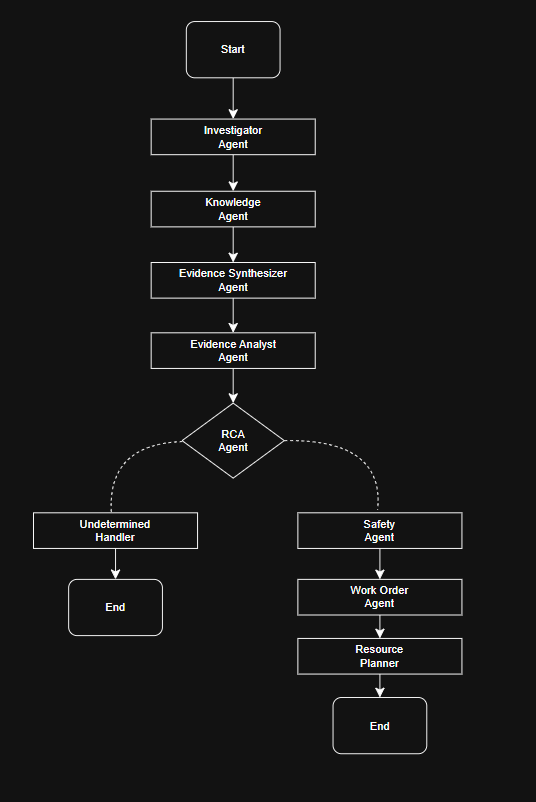

# PlantOps Copilot - Agentic RAG System for Manufacturing Root-Cause Diagnosis

PlantOps Copilot is an agentic AI assistant for manufacturing maintenance. It investigates machine incidents using telemetry, alarms, maintenance manuals, safety SOPs, historical tickets, and structured resource data to produce evidence-grounded root-cause analysis, safety controls, work orders, and resource plans.

The project is built as a multi-agent workflow using LangGraph, retrieval-augmented generation, citation validation, structured LLM outputs, and deterministic evaluation.

---

## Key Features 

* **Agentic maintenance workflow** using LangGraph
* **RAG over plant knowledge** including manuals, SOPs, and historical tickets
* **Telemetry-aware investigation** from SQLite sensor and alarm data
* **Evidence-grounded RCA** with citation filtering and abstention behavior
* **Safety review agent** for LOTO, PPE, prohibited actions, and supervisor approval
* **Work-order generation** with maintenance steps, tools, skills, and success criteria
* **Resource planning** using technician skills, tool inventry, and spare-part availability
* **Evaluation framework** with golden retrieval tests, deterministic E2E checks, and LLM-as-judge scoring
* **Streamlit demo UI** for interactive plant incident investigation
  
---

## Problem Statement

Manufacturing maintenance teams often need to diagnose equipment issues using scattered information:

* live telemetry
* alarms
* maintenance manuals
* safety SOPs
* previous work orders
* tool inventory
* technician availability
* spare-part stock
  
A normal chatbot can easily hallucinate causes or generate unsafe repair steps. PlantOps Copilot solves this by using an agentic RAG workflow with structured outputs, citation validation, safety filtering, and abstention when evidence is insufficient.

---

## Architecture



---

## Agent Workflow

1. **Investigator Agent**
   
   Queries structured plant data from SQLite:

   * machine metadata
   * sensor readings
   * alarm events
   * operating limit violations
   * incident time window validation

2. **Knowledge Retrieval Agent**
   
   Retrieves relevant evidence from ChromaDB:

   * machine manuals
   * maintenance SOPs
   * historical work orders
   * machine-scoped documents
   * ticket sections such as root cause, symptoms, action taken, tools used, and duration

3. **Evidence Synthesizer**
   
   Builds a structured evidence package:

   * sensor findings
   * alarm findings
   * document findings
   * evidence status
   * normal / abnormal / insufficient-data state

4. **Evidence Analyst**
   
   Identifies candidate causes, competing hypotheses, and derived findings using the retrieved evidence.

5. **RCA Agent**
   
   Generate a structured root-cause report with:

   * incident summary
   * likely root cause
   * supporting evidence
   * contradictory evidence
   * recommendations
   * citations
  
  The RCA agent abstains with `Undetermined` when evidence is insufficient.

6. **Safety Agent**
   
   Extracts and filters safety controls:

   * lockout-tagout steps
   * required PPE
   * prohibited actions
   * supervisor approval requirements

7. **Work Order Agent**
   
   Generates a maintenance work order:

   * repair title
   * maintenance steps
   * required tools
   * required skills
   * safety requirements
   * success criteria
   * estimated duration

8. **Resource Planner**
   
   Matches the work order against structured plant resources:

   * tool inventory
   * skill catalog
   * technician availability
   * spare-part stock
   * low-stock warning

---

## Tech Stack

| Area | Tools |
| Language | Python |
| Agent Orchestration | LangGraph, LangChain |
| LLM | Groq LLM (llama-3.3-70b-versatile) |
| Vector DB | ChromaDB |
| Embeddings | Sentence Transformers |
| Structured Data | SQLite |
| Validation | Pydantic |
| UI | Streamlit |
| Testing | Pytest |

## Project Structure

```text
plantops-copilot/ │ ├── app.py ├── requirements.txt ├── pytest.ini ├── prompt_matrix.py ├── test_graph.py │ ├── data/ │ ├── config/ │ │ └── operating_limits.json │ └── raw/ │ ├── manuals/ │ ├── tickets/ │ └── structured/ │ ├── evaluation/ │ ├── README.md │ ├── retrieval_golden_set.json │ ├── evaluate_retrieval.py │ ├── evaluate_e2e_batch.py │ ├── evaluate_llm_judge.py │ ├── aggregate_llm_judge_results.py │ └── e2e_batches/ │ ├── src/ │ ├── agents/ │ │ ├── graph/ │ │ ├── nodes/ │ │ ├── prompts/ │ │ ├── schemas/ │ │ └── tools/ │ │ │ ├── rag/ │ ├── database/ │ └── data_generation/ │ └── test/
```

---

## Setup

1. **Clone the repository**
   
   `git clone https://github.com/HarishVk-05/plantops-copilot
   cd plantops-copilot
   `

2. **Create a virtual environment**
   
   `python -m venv .venv`

   windows:

   `.venv\Scripts\activate`

   Linux / maxOS:

   `source .venv/bin/activate`

3. **Install dependencies**
   
   `pip install -r requirements.txt`

4. **Add environment variables**
   
   Create a `.env` file in the project root:

   GROQ_API_KEY = your_groq_api_key_here

   Do not commit `.env` to GitHub.

---

## Rebuild Local Data

Generated SQLite databases and vector indexes are intentionally excluded from Git.

Run:

`python src/data_generation/generate_factory_data.py`
`python src/rag/build_vector_index.py`

This creates local processed artifacts such as:

data/processed/plantops.db 
data/processed/chroma_db/

---

## Run the App

`Streamlit run app.py`

Example incident queries:

1. PKG-L3 is down. Find out why.
   
2. CMP-A1 pressure looks wrong. Investigate.

3. Perform a routine health check on CNV-B2. No fault has been reported.
   
---

## Run Tests

`pytest -q`

---

## Evaluation

PlantOps Copilot includes three evaluation layers:

1. Retrieval evaluation
2. Deterministic end-to-end evaluation
3. LLM-as-judge evaluation

---

## Retrieval Evaluation

Run:

`python evaluation/evaluate_retrieval.py`

Current retrieval result:

| Metric | Result |
| Golden queries | 15 |
| Passed | 15/15 |
| Mean Precision | 0.44 |
| Mean Recall | 0.80 |
| Mean MRR | 0.83 |
| Mean nDCG | 0.77 |
| Evidence group coverage | 1.00 |

Top-k settings:

| Retrieval Type | k |
| RCA / knowledge retrieval | 8 |
| Safety retrieval | 5 |
| Work-order retrieval | 4 |

---

## Deterministic E2E Evaluation

Run each batch:

`python evaluation/evaluate_e2e_batch.py --batch evaluation/e2e_batches/batch1.json`
`python evaluation/evaluate_e2e_batch.py --batch evaluation/e2e_batches/batch2.json`
`python evaluation/evaluate_e2e_batch.py --batch evaluation/e2e_batches/batch3.json`
`python evaluation/evaluate_e2e_batch.py --batch evaluation/e2e_batches/batch4.json`
`python evaluation/evaluate_e2e_batch.py --batch evaluation/e2e_batches/batch5.json`

The deterministic evaluator checks:

* expected root cause
* abstention correctness
* citation validity
* forbidden source contamination
* required safety controls
* required tools
* required skills
* technician eligibility
* spare-part warnings
* empty work orders for undetermined cases

---

## LLM-as-Judge Evaluation

The LLM judge evaluates cached E2E reports one scenario at a time. It does not combine all reports into one long prompt.

Run:

`python evaluation/evaluate_llm_judge.py --batch evaluation/e2e_batches/batch1.json`
`python evaluation/evaluate_llm_judge.py --batch evaluation/e2e_batches/batch2.json`
`python evaluation/evaluate_llm_judge.py --batch evaluation/e2e_batches/batch3.json`
`python evaluation/evaluate_llm_judge.py --batch evaluation/e2e_batches/batch4.json`
`python evaluation/evaluate_llm_judge.py --batch evaluation/e2e_batches/batch5.json`

Aggregate results:

`python evaluation/aggregate_llm_judge_results.py`

Current LLM-as-judge result:

| Metric | Result |
| Scenarios | 15 |
| Passed | 14 / 15 |
| Pass rate | 93.33% |

Mean rubric scores:

| Dimension | Score |
| Groundedness | 4.80/5 |
| RCA quality | 4.80/5 |
| Citation quality | 4.87/5 |
| Safety quality | 5/5 |
| Work-order quality | 4.80/5 |
| Resource quality | 4.93/5 |
| Abstention quality | 4.73/5 |

The LLM judge uses a rubric with dimension-specific scoring and deterministic hard gates. Python computes the final pass/fail decision from judge scores instead of relying only on the LLM's `overall_pass` field.

---

## Example Output

For a packaging machine incident:

Input: 
PKG-L3 is down. Find out why.

RCA:
Likely root cause: Belt misalignment

Supporting evidence:
- packing_machine_manual.md | Likely Causes of Motor Overheating
- WO-2026-001.md | Root Cause
  
Work order:
- Inspect conveyor belt alignment
- Verify belt tension
- Adjust tracking rollers
- Restart under observation

Required tools:
- Belt tension gauge
- Alignment ruler
- Torque wrench
- Flashlight

Assigned technician:
- Arun Kumar


For a normal health-check case:

Input:
Perform a routine health check on CNV-B2. No fault has been reported.

RCA: 
Undetermined

Behavior:
- No corrective work order generated
- No technician assigned
- No spare parts reserved

---

## Safety and Grounding Controls

PlantOps Copilot includes multiple guardrails:

* Pydantic structured outputs
* citation filtering
* machine-scoped retrieval
* abstention for insufficient evidence
* no corrective work order for undetermined RCA
* safety review before work-order generation
* deterministic E2E regression checks
* LLM-as-judge qualitative review

## Known Limitations

This is a prototype built on synthetic plant data.

Known limitations currently tracked by evaluation:

1. **User-hypothesis anchoring**
   A false user claim can sometimes bias the RCA. For example, one evaluation case caused the packaging RCA to select `Blocked cooling fan` instead of the expected `Belt misalignment`.
2. **Intermittent safety over-filtering**
   In one deterministic safety scenario, required PPE was over-filtered by the safety reviewer. The deterministic evaluator catches this regression.
3. **Small synthetic corpus**
   The manuals, SOPs, tickets, telemetry, and inventory data are simulated for demonstration and evaluation.

Future improvements:

* stronger neutral retrieval queries that ignore user-proposed diagnoses
* stricter safety invariants for mandatory LOTO and PPE
* larger golden set across more equipment types
* human expert review of judge rubric
* deployment with role-based access and audit logs

---

## Why This Project Matters

Most LLM maintenance assistants can produce plausible but unsupported answers. PlantOps Copilot is designed around evidence:

* retrieve relevant machine-specific knowledge
* validate citations
* analyze telemetry and alarms
* abstain when evidence is weak
* generate safety-aware work orders
* evaluate failures instead of hiding them

This makes the project closer to an engineering-grade agentic AI system than a simple chatbot demo.

---

## Disclaimer

PlantOps Copilot is a research and hackathon prototype. It is not certified for real industrial safety or maintenance use. Any real-world deployment would require domain expert validation, safety certification, human approval workflows, and integration with plant maintenance systems.